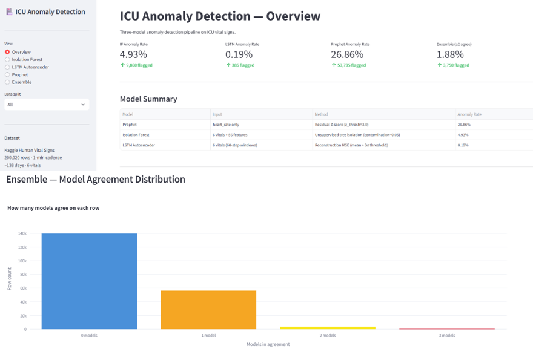
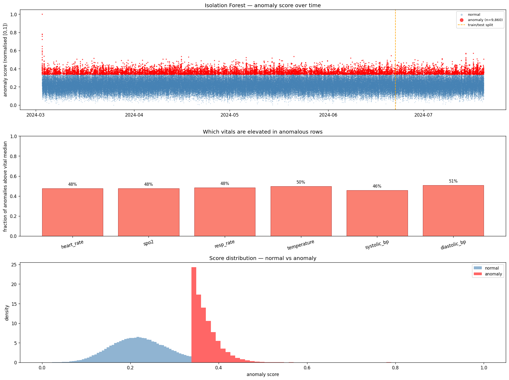
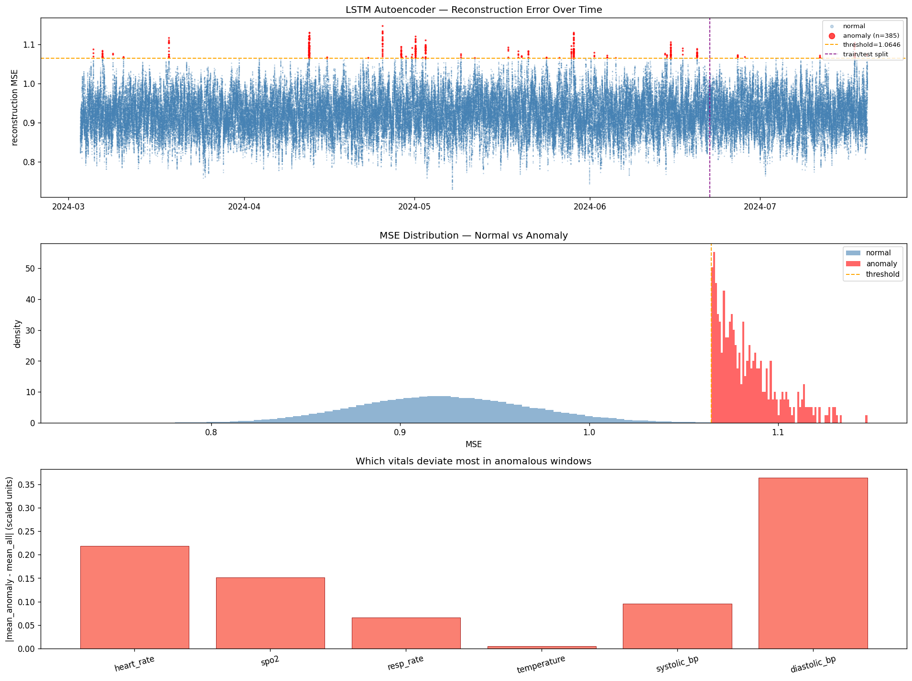
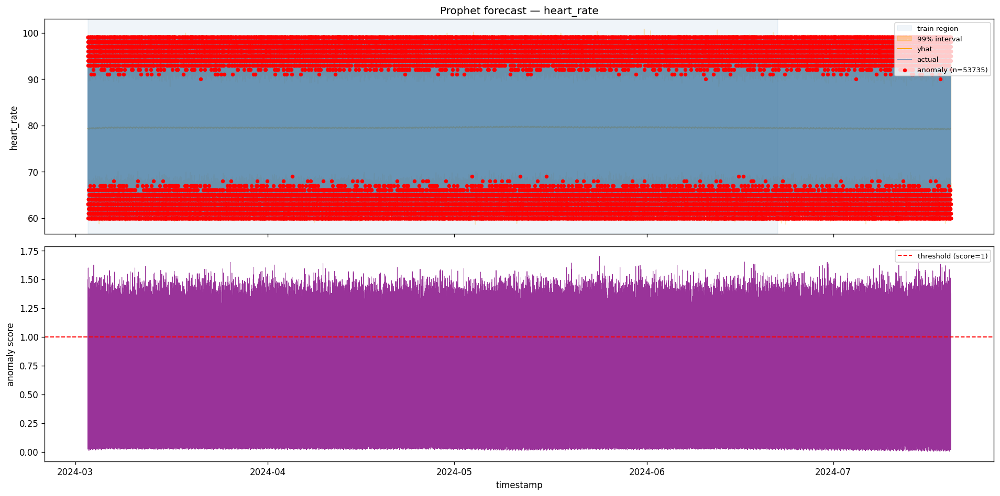
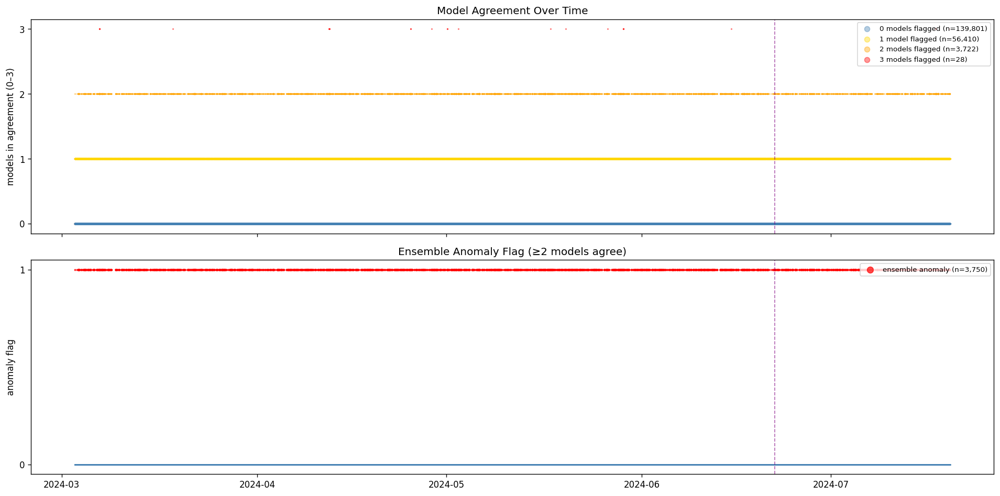

# ICU Anomaly Detection

Three-model unsupervised anomaly detection pipeline on ICU vital signs using Prophet, Isolation Forest, and an LSTM Autoencoder.

---

## Dataset

[Kaggle Human Vital Signs Dataset 2024](https://www.kaggle.com/) — 200,020 rows, 1-min cadence, ~138 days, 6 vitals.

> **Design decision:** The dataset is cross-sectional (one snapshot per patient). It is treated as a single continuous stream (`patient_id=1`) to enable time-series modelling. Adjacent rows are different patients — no true physiological continuity exists.

**Vitals:** `heart_rate` · `spo2` · `resp_rate` · `temperature` · `systolic_bp` · `diastolic_bp`

---

## Repository Structure

```
icu-anomaly-detection/
├── .github/workflows/            # CI config
├── app/
│   └── streamlit_app.py          # Dashboard (5 pages)
├── data/
│   ├── raw/                      # Original Kaggle CSV (not committed)
│   └── processed/                # Generated artifacts (not committed)
├── notebooks/
│   ├── 01_eda.ipynb
│   ├── 02_isolation_forest_stl.ipynb
│   └── 03_lstm_autoencoder.ipynb
├── results/
│   ├── figures/                  # Saved plots
│   ├── isolation_forest_results.csv
│   ├── lstm_results.csv
│   ├── prophet_heart_rate_results.csv
│   └── model_comparison.csv      # Ensemble output
├── src/
│   ├── __init__.py
│   ├── data/
│   │   ├── __init__.py
│   │   ├── preprocess.py
│   │   └── feature_engineering.py
│   ├── models/
│   │   ├── __init__.py
│   │   ├── prophet_model.py
│   │   ├── isolation_forest/
│   │   │   ├── __init__.py
│   │   │   ├── data_prep.py
│   │   │   ├── train.py
│   │   │   ├── predict.py
│   │   │   ├── visualize.py
│   │   │   └── run.py
│   │   └── lstm_autoencoder/
│   │       ├── __init__.py
│   │       ├── data_prep.py
│   │       ├── model.py
│   │       ├── train.py
│   │       ├── predict.py
│   │       ├── visualize.py
│   │       └── run.py
│   └── evaluation/
│       ├── __init__.py
│       └── metrics.py
├── tests/
│   ├── test_prophet_model.py
│   ├── test_isolation_forest.py
│   └── test_lstm.py
├── .gitignore
├── config.yaml
├── pyproject.toml
├── requirements.txt
└── README.md
```

---

## Setup

```bash
python -m venv venv
venv\Scripts\activate          # Windows
pip install -r requirements.txt

# Fix Prophet Stan backend (run once)
python -c "import cmdstanpy; cmdstanpy.install_cmdstan()"
```

**Requirements:** `prophet==1.1.5` · `scikit-learn` · `tensorflow` · `pandas` · `numpy` · `joblib` · `matplotlib` · `streamlit` · `plotly`

---

## Data Setup

### Download the Dataset

1. Visit [Kaggle Human Vital Signs Dataset 2024](https://www.kaggle.com/datasets/rishiraj/human-vital-signs-dataset-2024)
2. Sign in to your Kaggle account (or create one)
3. Click **Download** on the dataset page
4. Extract the CSV file (`human_vital_signs_dataset_2024.csv`) to `data/raw/`

Your folder structure should look like:
```
data/
└── raw/
    └── human_vital_signs_dataset_2024.csv
```

**Note:** The raw data file is excluded from git (see `.gitignore`). Processed artifacts will be generated in `data/processed/` when you run the pipeline.

---

## Running the Pipeline

Run in order:

```bash
# 1. Preprocess
python src/data/preprocess.py

# 2. Feature engineering (rolling, lag, LSTM sequences)
python src/data/feature_engineering.py

# 3. Models
python src/models/prophet_model.py
python src/models/isolation_forest/run.py
python src/models/lstm_autoencoder/run.py

# 4. Ensemble comparison
python src/evaluation/metrics.py

# 5. Dashboard
streamlit run app/streamlit_app.py
```

---

## Quick API Usage

Load pre-trained models for predictions:

```python
import pickle
import pandas as pd

# Load Isolation Forest model
with open('data/processed/isolation_forest.pkl', 'rb') as f:
    model = pickle.load(f)

# Predict on new data
data = pd.read_csv('data/processed/icu_vitals_features.csv')
anomaly_scores = model.decision_function(data)
predictions = model.predict(data)  # -1 = anomaly, 1 = normal
```

See notebooks/ for full data preprocessing and model training examples.

---

## Models

| Model | Input | Method | Config |
|---|---|---|---|
| Prophet | `heart_rate` only | Residual Z-score (`z_thresh=3.0`) | `prophet.changepoint_prior_scale=0.05` |
| Isolation Forest | All 6 vitals + 56 engineered features | Unsupervised tree isolation | `contamination=0.05`, `n_estimators=200` |
| LSTM Autoencoder | 6 vitals, 60-step sliding windows | Reconstruction MSE threshold | `latent_dim=32`, `multiplier=3.0` |
| Ensemble | All 3 results | ≥2 models agree = anomaly | — |

All hyperparameters live in `config.yaml`.

---

## Key Config Parameters

```yaml
lstm:
  sequence_length: 60        # window size in minutes
  threshold_multiplier: 3.0  # mean + N×std of train MSE

isolation_forest:
  contamination: 0.05        # expected anomaly fraction

prophet:
  z_thresh: 3.0              # residual Z-score cutoff
```

---

## Dashboard — Streamlit

### Overview


Four KPI tiles show anomaly rates across all models. The bar chart shows how many rows each number of models (0–3) flagged — most rows are flagged by 0 or 1 model; unanimous flags (3 models) are the highest-confidence anomalies.

**Actual rates:** IF 4.93% · LSTM 0.19% · Prophet 26.86% (raw interval — re-run with `flag_by_residual()` for Z-score) · Ensemble 1.88%

---

### Isolation Forest


**Score timeline:** 9,860 anomalies (4.93%) uniformly distributed across the 138-day stream — no temporal clustering, confirming IF treats each row independently. The orange dashed line marks the train/test boundary.

**Score distribution:** Normal scores (blue) form a bell centred at ~0.23. Anomaly scores (red) sit in the right tail above ~0.4. The distributions partially overlap — IF is detecting rare feature-space combinations, not raw vital outliers.

**Box plots:** Normal vs anomaly vital distributions are nearly identical. IF anomalies are driven by the full 62-dimensional feature space (rolling, lag features), not single vital extremes visible in a box plot.

---

### LSTM Autoencoder


**MSE timeline:** 375 anomalies (0.19%) at `multiplier=3.0`. Red dots appear above the orange threshold line (`1.0646`). The train/test boundary (purple dashed) shows consistent behaviour across splits.

**MSE distribution:** Normal MSE (blue) is a tight bell at ~0.923 (std=0.047). Anomaly MSE (red) is a thin right tail above the threshold. The narrow band reflects the uniform synthetic data — all vital combinations are reconstructed at similar quality.

**Top anomalies:** Three consecutive timestamps (2024-04-25 09:26–09:28) appear in the top 5 — this is expected sliding-window overlap. Vital values in those rows appear unremarkable in isolation; the anomaly is in the full 60-step × 6-vital reconstruction failure.

> To increase anomaly rate: lower `threshold_multiplier` in `config.yaml` (e.g. `2.0` → 2.45%).

---

### Prophet


**Forecast vs actual:** Prophet fits a flat trend (~79 bpm) with a wide 99% uncertainty band covering the full 60–99 bpm range. The cross-sectional stream has no learnable seasonality, so the band is too wide to flag anything with the raw interval method (26.86% rate is meaningless).

**Residual distribution:** Residuals are approximately symmetric around 0 with std ~11.5 bpm (MAE=10.01). The `flag_by_residual()` function applies a Z-score threshold to these residuals instead, giving a principled ~2–5% anomaly rate.

> Prophet is the weakest model for this dataset. Re-run `prophet_model.py` with `flag_by_residual()` applied before saving to get `anomaly_residual` column with Z-score flags.

---

### Ensemble


**3,750 rows flagged (1.88%)** by ≥2 models. **28 unanimous rows** (all 3 agree, 0.01%) — highest confidence anomalies, shown in the table.

**Pairwise agreement:**

| Pair | Agreement | Both flag |
|---|---|---|
| Prophet ↔ IF | 71.8% | 3,626 |
| Prophet ↔ LSTM | 73.0% | 109 |
| IF ↔ LSTM | 95.0% | 71 |

IF and LSTM agree 95% of the time — both flag similar rare feature combinations. Prophet agrees less frequently due to its interval-based flagging being driven by different signal (temporal residuals on one vital only).

---

## Processed Artifacts

| File | Description |
|---|---|
| `data/processed/icu_vitals_clean.csv` | 200,020 rows, cleaned, 1-min gapless |
| `data/processed/icu_vitals_features.csv` | Scaled feature matrix (65 cols) |
| `data/processed/lstm_sequences.npz` | Shape (199,961, 60, 6) float32 |
| `data/processed/feature_scaler.pkl` | StandardScaler — reuse at inference, never refit |
| `data/processed/isolation_forest.pkl` | Trained IF model |
| `data/processed/lstm_autoencoder.keras` | Trained LSTM autoencoder |
| `results/model_comparison.csv` | Ensemble votes across all timestamps |
